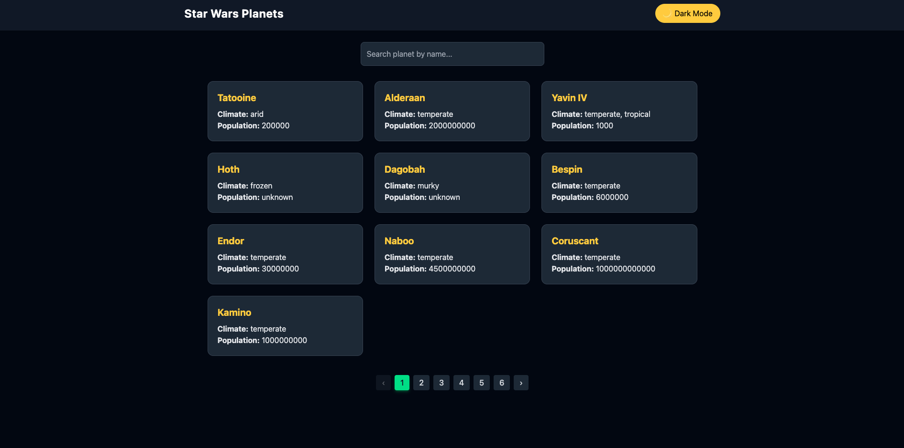

🌌 Star Wars Planets

Star Wars Planets is a modern React + TypeScript project that allows you to explore planets from the Star Wars universe. Using the SWAPI (Star Wars API), the app fetches planet data, displays detailed information, and lists residents with a clean, responsive, and dark-mode-ready interface.

This project is built for portfolio purposes and demonstrates frontend skills with React, TypeScript, Tailwind CSS, Zustand, and Axios.

✨ Features

Planet Listing

Browse all Star Wars planets in a responsive, paginated grid layout.

Search & Filter

Quickly find planets by name with a live search input.

Planet Details

Detailed information for each planet, including:

Climate, Gravity, Population, Terrain

Films featuring the planet

Residents with personal details (gender, hair, eyes, species, vehicles)

Resident Cards

Clean card component to display each resident's attributes.

Theme Toggle

Switch between light and dark modes with state persisted in localStorage.

Responsive & Accessible Design

Fully responsive layouts using Tailwind CSS.

Semantic HTML for better accessibility.

Loading States

Loader components displayed while fetching data from the API.

🛠 Tech Stack

Frontend Framework: React 19 + TypeScript

State Management: Zustand

Routing: React Router DOM

HTTP Requests: Axios

Styling: Tailwind CSS + PostCSS + Autoprefixer

Testing: Jest

Build Tool: Vite

Linting: ESLint

🚀 Getting Started

Clone the repository

git clone <your-repo-url>
cd starwars-planets

Install dependencies

npm install

Run the development server

npm run dev

Open the app

Visit http://localhost:5173
 in your browser.

🔍 Usage

Navigate to the home page to browse planets.

Use the search bar to filter planets by name in real-time.

Click on a planet to view detailed information and residents.

Toggle between light and dark themes using the header switch.

Navigate through pages using the pagination controls.

🧩 Components Highlights

PlanetCard – Displays planet summary with hover animations.

PersonCard – Displays resident information including species and vehicles.

Pagination – Dynamic pagination with highlighted current page.

ThemeToggle – Switch between light and dark themes with persistence.

⚡ Notes

Data is fetched from SWAPI
.

Some properties like population, terrain, or climate may show placeholders if the API returns "unknown".

Films and residents are dynamically fetched for each planet.

🎨 Screenshots

  

💻 Portfolio Showcase

This project is not intended for public contribution. It serves as a portfolio piece to demonstrate:

Modern frontend development skills

React + TypeScript + Tailwind CSS integration

API consumption with Axios

State management with Zustand

Responsive and accessible UI design
